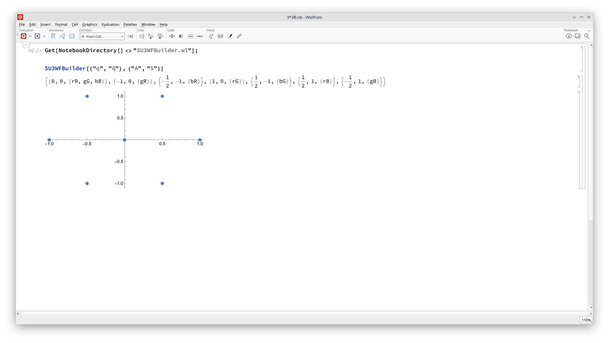
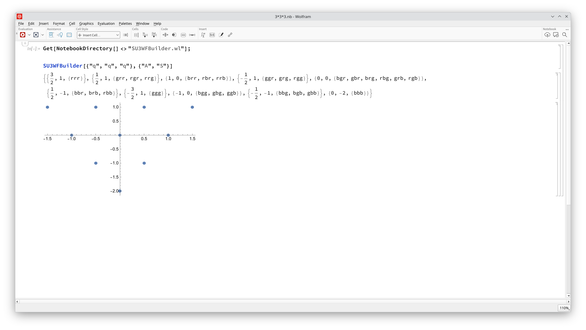
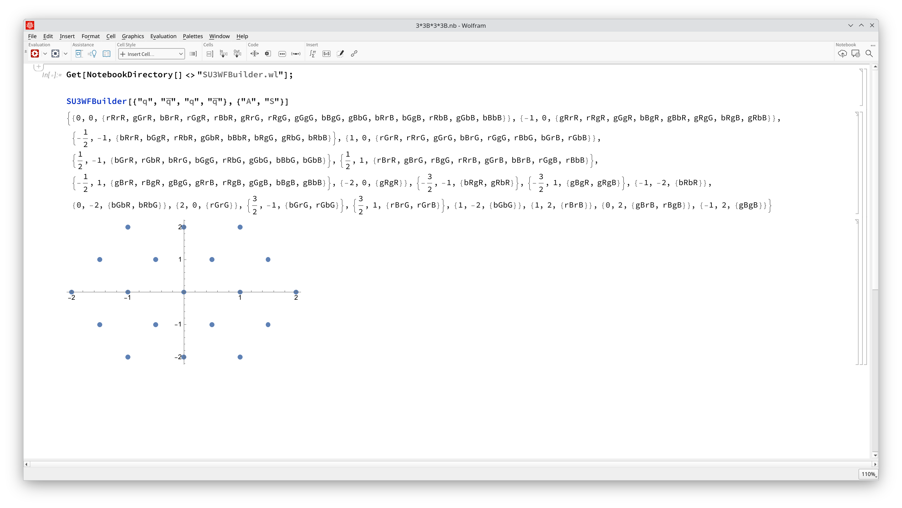
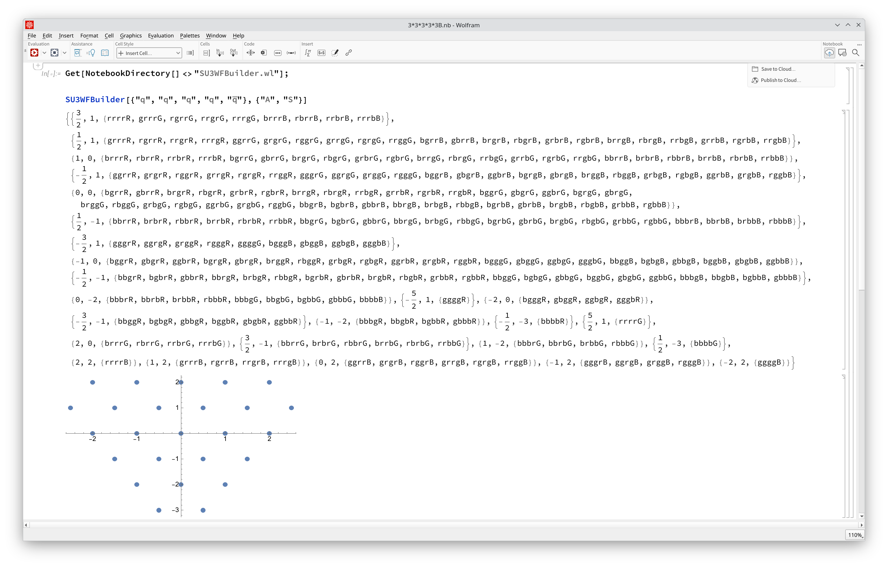

# SU3WFBUILDER

- [x] support meson, baryon, tetraquark, pentaquark and hexaquark system
- [x] output color bases and corresponding root system
- [ ] build color wavefunction regarding flavor symmetry
 

